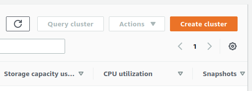
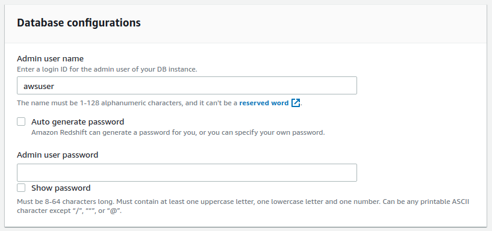

# Amazon Redshift Blueprints

## Authorization

### Overview

In order to get started with Redshift Blueprints, the cluster access information must be retrieved.

### Steps

1. Login to your [AWS Management Console](https://aws.amazon.com/console/)  
2. Search for and go to the Redshift service page  
3. Click "Clusters" on the left sidebar  
4. Click "Create cluster" on the Clusters panel  
	   
5. In the panel "Database configurations" you will be prompted to provide a user name and user password  
	  
6. Copy these values into the "Input" section of the Blueprint for the Username and Password fields  
	  

### Notes

- AWS [`get-cluster-credentials`](https://docs.aws.amazon.com/cli/latest/reference/redshift/get-cluster-credentials.html) resource for getting a cluster user name and user password via the CLI

## Execute Query Blueprint

### Overview

Execute any SQL query against your Redshift database. Perfect for creating multi-step SQL jobs, executing DML statements, or running scheduled queries.

### Variables

| Variable Name | Description |
|:---|:---|
| **Host** | [REQUIRED] Domain or the IP address of the database to connect to |
| **Port** | [REQUIRED] Port number where the database accepts inbound connections |
| **Username** | [REQUIRED] Username configured as part of the database credentials - see **Authorization** above for more information |
| **Password** | Optional password for database security credentials - see **Authorization** above for more information |
| **Database** | Name of the database to connect to |
| **Extra URL Parameters** | Extra parameters that will be placed at the end of the connection string, after the "?". Must be separated by "&" |
| **Query** | [REQUIRED] SQL query to run against the target database |

## Store Query Results as CSV Blueprint

### Overview

Turn the results of your SQL SELECT statement into a CSV file. Extract your Amazon Redshift data into files for easier delivery to clients and partners.

### Variables

| Variable Name | Description |
|:---|:---|
| **Host** | [REQUIRED] Domain or the IP address of the database to connect to |
| **Port** | [REQUIRED] Port number where the database accepts inbound connections |
| **Username** | [REQUIRED] Username configured as part of the database credentials - see **Authorization** above for more information |
| **Password** | Optional password for database security credentials - see **Authorization** above for more information |
| **Database** | Name of the database to connect to |
| **Extra URL Parameters** | Extra parameters that will be placed at the end of the connection string, after the "?". Must be separated by "&" |
| **Query** | [REQUIRED] SQL query to run against the target database |
| **Folder Name** | Optional subdirectory to store results in Shipyard |
| **File Name** | [REQUIRED] Name for CSV query output file |

## Upload CSV to Table

### Overview

Upload a CSV file to any table in Amazon Redshift. With the file data, you can create a new table, overwrite the existing table, or append to the end of the table.

### Variables

| Variable Name | Description |
|:---|:---|
| **Host** | [REQUIRED] Domain or the IP address of the database to connect to |
| **Port** | [REQUIRED] Port number where the database accepts inbound connections |
| **Username** | [REQUIRED] Username configured as part of the database credentials - see **Authorization** above for more information |
| **Password** | Optional password for database security credentials - see **Authorization** above for more information |
| **Database** | Name of the database to connect to |
| **Extra URL Parameters** | Extra parameters that will be placed at the end of the connection string, after the "?". Must be separated by "&" |
| **Query** | [REQUIRED] SQL query to run against the target database |
| **Folder Name** | Optional subdirectory to store results in Shipyard |
| **File Name** | [REQUIRED] Name for CSV query output file |
| **Table Name** | [REQUIRED] Redshift table name to insert data into |
| **Insertion Method** | [REQUIRED] Dropdown with options for determining how data is inserted into the table |

## Helpful Links

[Amazon Redshift Help Docs](https://docs.aws.amazon.com/redshift/)
