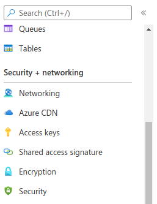
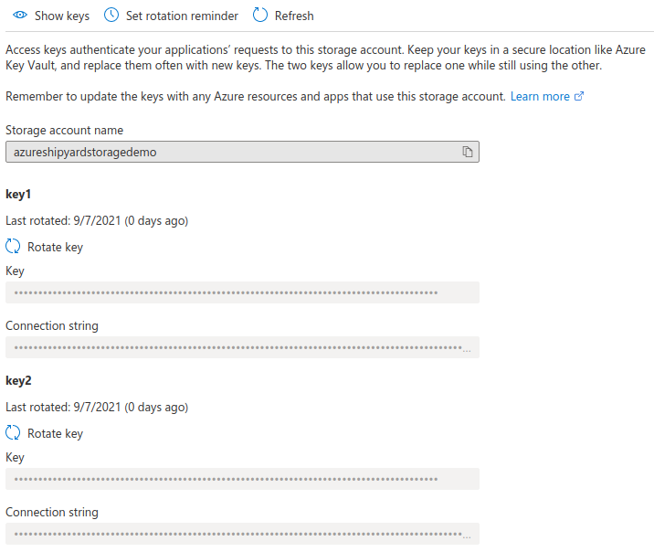

# Azure Blob Storage Blueprints

## Authorization

### Overview

In order to get started with the Azure Blueprints, an access key connection string is required.

### Steps

1. Login to your [Azure Portal](https://portal.azure.com/)  
2. Search for and click on "Storage accounts"  
	  
3. Select the desired storage account from the table  
	  
4. Scroll down left sidebar to the "Security + networking" section and click "Access keys"  
	  
5. Click the "Show keys" button at the top of the access keys page  
	  
6. Click the "copy" icon for the "Connection string" text field under the `key` option  
7. Paste the copied value in the "Connection String" Blueprint inputs below  

## Download Files Blueprint

### Overview

The **Azure Blob Storage - Download Files** Blueprint allows users to quickly export one or more files from an Azure Blob Storage container.  

### Variables

| Variable Name | Description |
|:---|:---|
| **Container Name** | [REQUIRED] Name for the target Azure storage container |
| **Azure Storage Folder Name** | Name for the target file folder |
| **Azure Storage File Name Match Type** | [REQUIRED] Method by which Shipyard should look for the file name in Azure storage |
| **Azure Storage File Name** | [REQUIRED] Name for the target file to download to the Shipyard Vessel |
| **Local Folder Name** | Name for the folder to download into in the Shipyard Vessel |
| **Local File Name** | Name to give the downloaded file in the Shipyard Vessel |
| **Connection String** | Connection string for programmatic access to download the file - see [**Authorization**](#authorization) above for more information |

## Upload Files Blueprint

### Overview

The **Azure Blob Storage - Upload Files** Blueprint allows users to easily import one or more files directly into an Azure Blob Storage container, no matter how big they are.  

### Variables

| Variable Name | Description |
|:---|:---|
| **Local Folder Name** | Name for the folder in the Shipyard Vessel to upload from |
| **Local File Name Match Type** | [REQUIRED] Method by which Shipyard should look for the file name in its local directory |
| **Local File Name** | [REQUIRED] Name for the target file to upload in the Shipyard Vessel |
| **Container Name** | [REQUIRED] Name for the target Azure storage container |
| **Azure Storage Folder Name** | Name for the target file folder |
| **Azure Storage File Name** | Name for the target file to uploaded to Azure storage |
| **Connection String** | Connection string for programmatic access to download the file - see [**Authorization**](#authorization) above for more information |

## Helpful Links

[Azure Blob Storage Help Docs](https://docs.microsoft.com/en-us/azure/storage/blobs/)
