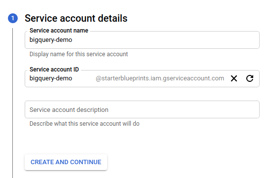
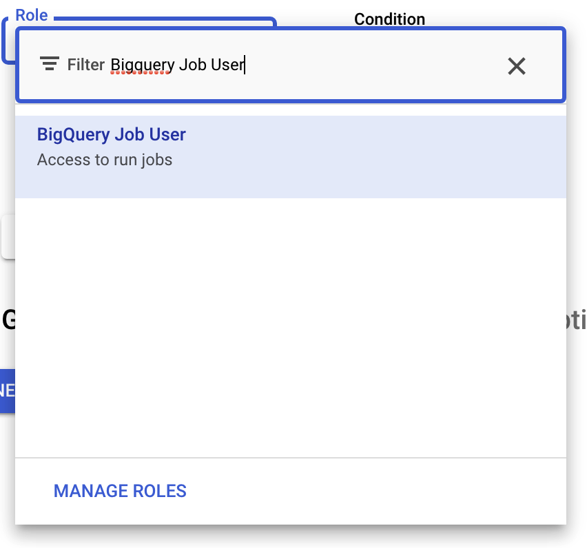
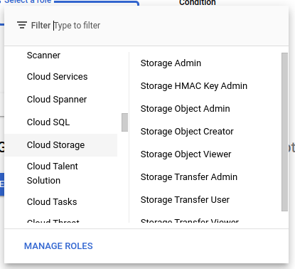
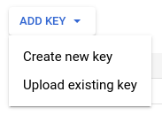

# Google BigQuery Blueprints

## Authorization

### Overview

In order to get started with the Google BigQuery Blueprints, a service account with the necessary GCP permissions is required.

### Creating a BigQuery Service Account

1. Login to your [GCP console](https://console.cloud.google.com/)
2. Using the top selector, choose the Project where your BigQuery Instance lives.  

3. Open the sidebar and select "**IAM & Admin**"  
	  
3. Click "**Service Accounts**" in the options  
4. Click "**+ CREATE SERVICE ACCOUNT**"  
	  
5. Add a service account name  
	a. Do not edit the ID field which will auto-populate  
	b. Optionally add a description to the service account  
	  
6. Click "**CREATE AND CONTINUE**"  
7. Click "**Select a role**" dropdown  
	
	a. Search for and select "**BigQuery Data Editor**"  
	
	b. "Click "+ ADD ANOTHER ROLE"  
	c. Search for and select "**BigQuery Job User**"  
	
	:::info
	If you want to use our "Store Query Results in Google Cloud Storage" Blueprint, you will also need to:
	
	a. "Click "+ ADD ANOTHER ROLE"  
	b. Click the "**Select a role**" dropdown  
	c. Search for and select **Storage Object Admin**  
	
	:::  

8. Click "**CONTINUE**"  
9. Click "**DONE**"  
10. Find the new service on the service accounts table  
	a. Click the menu dots under the "Actions" column  
	b. Click "**Manage keys**"  
	  
11. On the Keys page click the "**ADD KEY**" dropdown  
12. Click "**Create new key**"  
	  
13. In the popup modal select the "**JSON**" radio button  
14. Click "**CREATE**"  
15. Copy the downloaded file JSON contents and save for safe keeping. The contents of this file can be pasted into the "**Service Account**" input for all Bigquery Blueprints.

## Execute Query Blueprint

### Overview

The **Google BigQuery - Execute Query** Blueprint allows users to execute any Standard SQL query against a Google BigQuery database.

### Variables

| Variable Name | Description |
|:---|:---|
| **Query** | [REQUIRED] Query to run against the BigQuery database |
| **Service Account** | [REQUIRED] JSON from a Google Cloud Service account key - see **Authorization** above for more information |

## Store Query Results as CSV Blueprint

### Overview

The **Google BigQuery - Store Query Results as CSV** Blueprint allows users to turn the results of their SQL SELECT statement into a CSV file.

### Variables

| Variable Name | Description |
|:---|:---|
| **Query** | [REQUIRED] Query to run against the BigQuery database |
| **Local File Name** | [REQUIRED] Name of file to be generated with the results which should be a CSV file. |
| **Local Folder Name** | Folder name to store the results file in |
| **Service Account** | [REQUIRED] JSON from a Google Cloud Service account key - see **Authorization** above for more information |

## Store Query Results in Google Cloud Storage Blueprint

### Overview

The **Google BigQuery - Store Query Results in Google Cloud Storage** Blueprint allows users to turn the results of their SQL SELECT statement into CSV files that get stored in Google Cloud Storage (GCS).

### Variables

| Variable Name | Description |
|:---|:---|
| **Query** | [REQUIRED] Query to run against the BigQuery database |
| **Bucket Name** | [REQUIRED] Name of the GCS bucket to store the results file in |
| **Bucket File Name** | [REQUIRED] Name of file to be generated with the results which should be a CSV file. |
| **Bucket Folder Name** | Folder name to store the results file in |
| **Service Account** | [REQUIRED] JSON from a Google Cloud Service account key - see **Authorization** above for more information |

## Upload CSV to Table Blueprint

### Overview

The **Google BigQuery - Upload CSV to Table** Blueprint allows users to upload a CSV file to any table in Google BigQuery.

### Variables

| Variable Name | Description |
|:---|:---|
| **Dataset Name** | [REQUIRED] Name of the dataset to be uploaded to BigQuery |
| **Table Name** | [REQUIRED] Name of the BigQuery table to upload the dataset to |
| **Local File Name Match Type** | [REQUIRED] Dropdown selection of how to match the file name |
| **Local File Name** | [REQUIRED] Name of the CSV file containing data to upload to BigQuery |
| **Local Folder Name** | Local folder name where the CSV file to upload is stored |
| **Upload Method** | [REQUIRED] Dropdown selection for how to upload the data to BigQuery |
| **Service Account** | [REQUIRED] JSON from a Google Cloud Service account key - see **Authorization** above for more information |
| **Schema** | Schema for the uploaded dataset - if not provided it will be auto-detected |
| **Header Rows to Skip** | Number of header rows to skip when inserting data - only required if provided custom schema |

## Helpful Links
- [Creating Google Cloud Platform Service Accounts](https://cloud.google.com/iam/docs/creating-managing-service-accounts)
- [Creating Google Cloud Platform Service Account Keys](https://cloud.google.com/iam/docs/creating-managing-service-account-keys)
- [Google Bigquery Python Library Documentation](https://cloud.google.com/bigquery/docs/reference/libraries)  
- [Pandas to_sql Method](https://pandas.pydata.org/pandas-docs/stable/reference/api/pandas.DataFrame.to_sql.html)  
