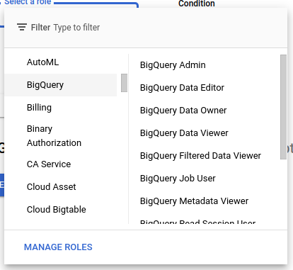
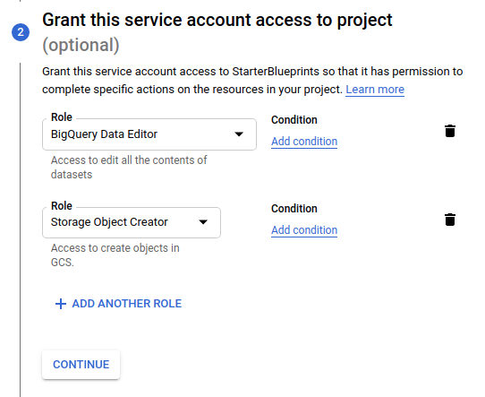

# Google BigQuery Blueprints

## Authorization

### Overview

In order to get started with the Google BigQuery Blueprints, a service account with the necessary GCP permissions is required.

### Steps

1. Login to your [GCP console](https://console.cloud.google.com/)  
2. Hover over "IAM & Admin" in the sidebar  
	  
3. Click "Service Accounts" in the options  
4. Click "+ CREATE SERVICE ACCOUNT"  
	  
5. Add a service account name  
	a. Do not edit the ID field which will auto-populate  
	b. Optionally add a description to the service account  
	  
6. Click "CREATE AND CONTINUE"  
7. Click "Select a role" dropdown  
	a. Scroll down the options and hover over "BigQUery"  
	b. Select "BigQuery Data Editor"  
	  
8. Click "+ ADD ANOTHER ROLE"  
	a. Scroll down the options and hover over "Cloud Storage"  
	b. Select "Storage Object Creator"  
	  
9. Click "CONTINUE"  
	  
10. Click "DONE"  
11. Find the new service on the service accounts table  
	a. Click the menu dots under the "Actions" column  
	b. Click "Manage keys"  
	  
12. On the Keys page click the "ADD KEY" dropdown  
13. Click "CREATE NEW KEY"  
	  
14. In the popup modal select "JSON"  
15. Click "CREATE"  
16. Copy the downloaded file JSON contents and use in the "Service Account" variable input in the Blueprints (see **Variables** sections below)  

### Notes

- Creating [service accounts](https://cloud.google.com/iam/docs/creating-managing-service-accounts)
- Creating [service account keys](https://cloud.google.com/iam/docs/creating-managing-service-account-keys)

## Execute Query Blueprint

### Overview

The **Google BigQuery - Execute Query** Blueprint allows users to run arbitrary queries against BigQuery.

### Variables

| Variable Name | Description |
|:---|:---|
| **Query** | [REQUIRED] The query to run against the BigQuery database |
| **Service Account** | [REQUIRED] The JSON from a Google Cloud Service account key - see **Authorization** above for more information |

## Store Query Results as CSV Blueprint

### Overview

The **Google BigQuery - Store Query Results as CSV** Blueprint allows users to run arbitrary queries against BigQuery and store the CSV output in the Shipyard Vessel.

### Variables

| Variable Name | Description |
|:---|:---|
| **Query** | [REQUIRED] The query to run against the BigQuery database |
| **Local File Name** | [REQUIRED] Name of file to be generated with the results which should be a `.csv` extension. |
| **Local Folder Name** | The optional folder name to store the results file in |
| **Service Account** | [REQUIRED] The JSON from a Google Cloud Service account key - see **Authorization** above for more information |

## Store Query Results in Google Cloud Storage Blueprint

### Overview

The **Google BigQuery - Store Query Results in Google Cloud Storage** Blueprint allows users to run arbitrary queries against BigQuery and store them in Google Cloud Storage (GCS).

### Variables

| Variable Name | Description |
|:---|:---|
| **Query** | [REQUIRED] The query to run against the BigQuery database |
| **Bucket Name** | [REQUIRED] Name of the GCS bucket to store the results file in |
| **Bucket File Name** | [REQUIRED] Name of file to be generated with the results which should be a `.csv` extension |
| **Bucket Folder Name** | The optional folder name to store the results file in |
| **Service Account** | [REQUIRED] The JSON from a Google Cloud Service account key - see **Authorization** above for more information |

## Upload CSV to Table Blueprint

### Overview

The **Google BigQuery - Upload CSV to Table** Blueprint allows users to upload a CSV file to a BigQuery table.

### Variables

| Variable Name | Description |
|:---|:---|
| **Dataset Name** | [REQUIRED] The name of the dataset to be uploaded to BigQuery |
| **Table Name** | [REQUIRED] The name of the BigQuery table to upload the dataset to |
| **Local File Name Match Type** | [REQUIRED] A dropdown selection of how to match the file name |
| **Local File Name** | [REQUIRED] The name of the CSV file containing data to upload to BigQuery |
| **Local Folder Name** | The optional local folder name where the CSV file to upload is stored |
| **Upload Method** | [REQUIRED] A dropdown selection for how to upload the data to BigQuery |
| **Service Account** | [REQUIRED] The JSON from a Google Cloud Service account key - see **Authorization** above for more information |
| **Schema** | The schema for the uploaded dataset - if not provided it will be auto-detected |
| **Header Rows to Skip** | Number of header rows to skip when inserting data - only required if provided custom schema. |

## Helpful Links

[Google Bigquery Python Library Documentation](https://cloud.google.com/bigquery/docs/reference/libraries) [Pandas to_sql Method](https://pandas.pydata.org/pandas-docs/stable/reference/api/pandas.DataFrame.to_sql.html)
