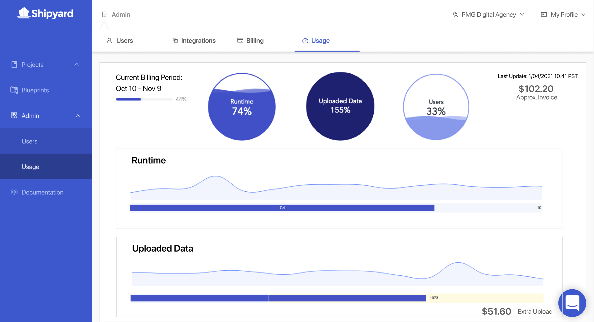

# Usage Dashboard

## Definition

The usage dashboard shows key details around how your organization is using Shipyard and how it impacts your billing. The dashboard shows 3 primary metrics.

- Runtime Hours Used
- GB of Data Uploaded
- Users with Access

For these 3 primary metrics, you can visualize the data in 4 different ways:

- % of plan allotment used. Anything over 100% will charge an overage.
- Usage by date. Shown as a line graph.
- Total usage during the billing period. Shown as a bullet chart.
  - If the bar is shown over a purple background, your total is still under the allotment.
  - If the background is yellow, your total includes some overage.
- Estimated overage charge. Shown only if your usage is over the allotment for your plan.

In addition, the usage dashboard will show you:

- The date range of the current billing period.
- The % of the current billing period that has already passed
- The last date the data was updated.
- The approximate invoice total for the current billing period.

## Screenshots

## Limitations

1. The dashboard only shows usage data for the current billing period.
2. The usage data will only update every 24 hours.
3. The current billing period start and end date does not include the full day. For example, your Billing period can end at 4:03:11 PM on the 12th and start at 4:03:12 PM on the 12th.
4. Values in the dashboard are approximated and rounded for easier interpretation. On the actual invoice, usage is charged by the second and uploaded data is charged by the byte.
