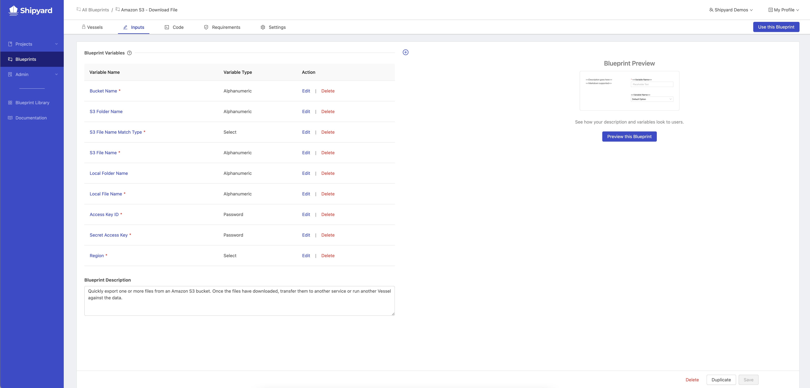

# Blueprint Variables

## Definition

Blueprint Variables are the variables that code relies on user input for. They don't exist directly in your code. Instead, they become present in the system as environment variables that your Blueprint can use while running.

A Blueprint can contain as many variables as you want. Blueprint variables can also be re-ordered to make it easier for users to understand the data input.

A user who creates a Vessel from your Blueprint is going to provide their own values on the [Input ](../vessels/form-input.md)tab for Blueprint Variables that you define. Those values then become available each time that the Vessel runs.

## Components

### Display Name

A required string of letters and digits. This name will be shown to a user on the input tab.

### Reference Name

A required string of letters and digits with no whitespace or special characters other than `_`. This name will be used to reference the data input by a user in your script. Variable names must be unique \(case sensitive\) within a Blueprint.

### Variable Type

A required high-level choice that helps provide validation for the user input. The following are the currently available variable types:

- **Alphanumeric -** Lets the user provide a string of text.
- **Integer -** Lets the user provide a number, rounded down.
- **Floating Point -** Lets the user provide a decimal number.
- **Boolean** - Lets the user select either a `TRUE` or `FALSE` value in the form of a checkbox.
- **Date** - Lets the user provide a date, using a date selector, in the `YYYY-MM-DD` format.
- **Select -** Lets a Blueprint creator define a restricted set of valid values \***\*as **Select Options\*\*. These values contain both a Display Name, shown to the user, and an Internal Value, passed to the code. Only those values that you define here will be available to the user.
- **Password** - Allows the user to provide a string that gets hidden by default.

:::caution
**Note:** Regardless of which variable type is selected, the final user input will always passed back to your code as a string.
:::

### **Default Value**

An optional field that provides a mechanism for defining the default value a variable should have if the user does not specify one when creating the Vessel. This field changes based on the variable type selected.

### **Required**

Indicates whether or not the user will have to provide this value for the Vessel to be built successfully.

### **Placeholder Text**

An option field to show greyed out text in an input box before the user provides input. Helpful for providing example values.

### **Description**

An optional field that will display in a tooltip next to the variable name. This should be provided so that users of your Blueprint know what value should be input and what your Blueprint is going to do with that value.

## Accessing Values

All of the user input provided when setting up a Vessel will be provided to your code at runtime. There are two ways to access the user input provided to a Blueprint Variable:

### **Pass Variables Into Script**

You can obtain the variable's value via either the [command arguments ](../vessels/code/command.md)or as an [environment variable value ](../vessels/environment-variables/)by referencing the variable using `${variable_name}`. The variable name will **exactly match** the Blueprint Variable's [**Reference Name**](blueprint-variables.md#reference-name)**.** For example, if a variable's reference name is `Operator_A`, then you would reference it by typing`${Operator_A}`.

If you reference a `${variable_name}` that does not exist, the value will be returned as `None`.

We recommend this option, as it makes it extremely clear which variables are being passed to the script and how they are being used.

### **Set Variables Using Environment Variables**

In your code, you can obtain the value for the variable just like you would any other environment variable. The environment variable name will **exactly match** the Blueprint Variable's [**Reference Name**](blueprint-variables.md#reference-name). For example, if a variable's reference name is `Operator_A`, then its environment variable name will be `Operator_A`.

View the following article for more information on accessing environment variables.



:::caution
**Note:** A Blueprint's environment variables and Blueprint variables **are** **both** set as environment variables that can be accessed at runtime. It's important to make sure that the naming between these two sections doesn't overlap.
:::

:::danger
**Warning:** Make sure not to set any variables to important environment variable names like `PATH` or `HOME` unless you _really_ know what you're doing.
:::

## Screenshots

## Limitations

1. A Blueprint cannot have two variables with the same name.
2. A Blueprint variable cannot be conditionally shown or hidden based on a user's selection.
3. There is no built-in system to ensure that `${variable_name}` exactly matches a reference name. Make sure you don't have typos!

## Learn More

- [How to Create Blueprint Variables](../../how-tos/blueprints/how-to-create-blueprint-variables.md)
- [How to Reference a Blueprint Variable](../../how-tos/blueprints/how-to-reference-a-blueprint-variable.md)
- [How to Reorder Blueprint Variables](../../how-tos/blueprints/how-to-reorder-blueprint-variables.md)
