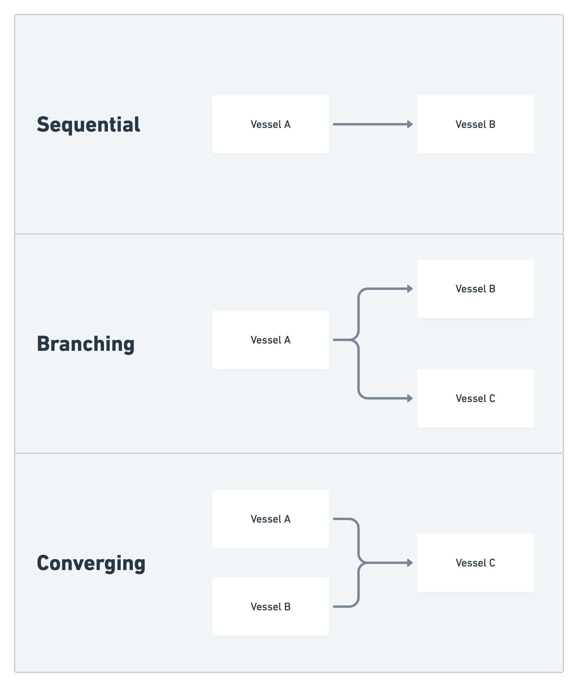
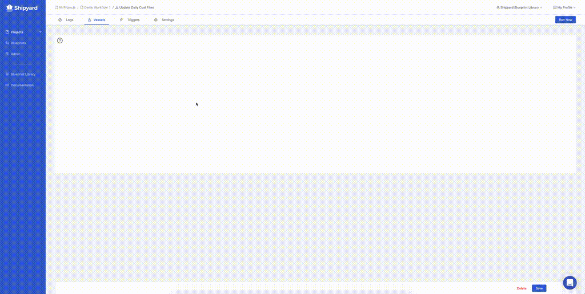

# Fleets

## Definition

A Fleet is a collection of multiple Vessels working together to tackle one larger job. Fleets are the equivalent of a Workflow or DAG in other orchestration tools.

Fleets can contain any number of Vessels and contain any different type of Vessels \(including a mixture of programming languages and Blueprints\). Vessels can be reused across multiple Fleets and can continue to run independently of the Fleets they belong to.

All Vessels are connected together with paths which check for the final status of the Vessel they are attached to. While success is checked for by default, the following statuses can be checked for:

- **Success** \(exit code 0\)
- **Errored** \(exit code 1-255\)
- **Completed** \(any exit code\)

### How Fleets Run

Vessels in a Fleet get run in the order that you choose, starting with one or multiple Vessels that don't have any paths feeding into them. A Fleet can be kicked off with a [Schedule Trigger](../triggers/schedule-triggers.md), a [Webhook Trigger](../triggers/webhook-triggers.md) or an [On Demand Trigger](../triggers/on-demand-triggers.md).

The paths between Vessels can be sequential \(one-to-one\), branching \(one-to-many\) or converging \(many-to-one\).

When an upstream Vessel finishes running, it returns a [status code](../other-functions/status.md) to indicate if the Vessel was successful \(exit code of 0\) or if it errored \(exit code of 1-255\). All paths coming out of the finished Vessel are immediately evaluated. If a path evaluates as true, it kicks off all downstream Vessels that are connected to it. If a path evaluates as false, it marks all downstream Vessels as incomplete.

If a Vessel is part of a converging path, it waits until all upstream Vessels have completed. At this point, every upstream Vessel is evaluated to see if the status matches the path condition. If all paths evaluate as true, the downstream Vessel will begin running. If any of the converging paths are evaluated as false, the downstream Vessel will not run.

### File Sharing

When a Fleet runs, it creates a temporary local file store. Files generated by upstream Vessels will be available to every downstream Vessel. Files can only be accessed by other Vessels within the current Fleet run. If the same Fleet is run twice or more in parallel, each instance will have it's own separate file store.

This design is the equivalent of running individual scripts one after another on your local computer. Creating two files with the same name in a Fleet will result in the most recent file overwriting the oldest file. Creating a file within a folder 

By default, all files generated are stored in the home directory, `/home/shipyard/` and all scripts are run from this same directory. To access any generated files, you do not need to include the home directory. However, if you have chosen to create a file in a subdirectory, that subdirectory structure must be included to access a file. To see a list of all files available in a Fleet, [follow this guide](../../how-tos/fleets/see-all-files).

Once every Vessel in the Fleet has finished running, all files are immediately wiped from the Shipyard platform.

This setup allows Vessels to be built to run independent, modular tasks off of newly generated data without needing to change business logic to upload/download files to/from an external storage solution. This setup allows greater flexibility in how you build Vessels and less coding overall when building out your workflows.

### Visual Editor

The Visual editor for Fleets, located on the Vessels tab of a Fleet, allows you to add and remove Vessels and Paths. This editor was designed to be an intuitive drag-and-drop mechanism to visualize and create complex solutions all in the same location.

For information about how to use the visual editor, hover over the question mark icon in the top-left corner.

- **Click** on the canvas to add a Vessel.
- **Click** on the Vessel name to edit it.
- **Click & Drag** on a Vessel to move it.
- **Click & Drag** on the Canvas to re-position your view of Vessels.
- **Hover** over a Vessel to reveal the delete button and the new path button.
- **Hover** over a path to reveal the delete button.
- **Click & Drag** from the new path button to another Vessel to create a path.
- **Click** on a path to change the condition to Success, Errored, or Completed.

## Screenshots

## Additional Notes

1. A Fleet cannot be set up with Vessels that live across multiple projects. You'll need to make sure that all of the relevant Vessels live within the same project.
2. A Fleet cannot contain any paths that would create a loop.
3. A Fleet must contain two or more Vessels that are all connected together by a path. If you want to have a set of Vessels that aren't connected to the larger group, you will need to create a different Fleet.
4. You are currently unable to kick off a Fleet starting anywhere in the middle, although you can kick off individual Vessels at will. This prevention is in place because we delete data as soon as a Fleet has finished running, whether it was successful or not. If you ran a Vessel starting from the middle and it relied on data created upstream, it would be unable to find that data and immediately fail.
5. A Fleet can only be created with Vessels that already exist. We currently don't support creating a Vessel _while_ creating a Fleet.
6. A Fleet cannot have two or more copies of the same Vessel. Once you select a Vessel, it becomes unavailable in the dropdown.

## Learn More

- [How to Delete a Fleet](../../how-tos/fleets/delete-fleet.md)
- [How to Create a New Fleet](../../how-tos/fleets/create-fleet.md)
