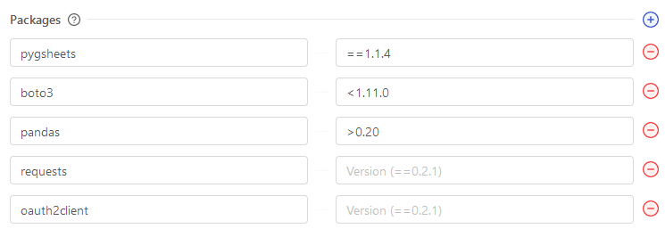

import Tabs from '@theme/Tabs';
import TabItem from '@theme/TabItem';

# External Package Dependencies

## Definition

Every language that Shipyard supports has packages that can be installed to enhance the functionality and simplicity of your scripts. If your script uses an external package, you'll have to tell Shipyard what packages to install before the script can run successfully.

How you enter this information varies by language.

<Tabs
groupId="languages"
defaultValue="python"
values={[
{label: 'Python', value: 'python'},
{label: 'Bash', value: 'bash'},
{label: 'Node', value: 'node'},
]}>
<TabItem value="python">

When you build a Vessel or Blueprint with Python, it comes with the latest version of pip pre-installed, allowing you to easily install python package dependencies. In order for your Vessel to run successfully, you must provide a way to install these packages. There are 2 options in the platform for installing Python packages.

#### Packages Module

On the Requirements tab of every Vessel, the right-hand side contains a module for installing packages. Packages should be formatted with the Package Name field filled out. Optionally, you can include a version for each package name that you've listed. Versions must be formatted according to [Python standards](https://www.python.org/dev/peps/pep-0440/#version-specifiers).

In order to install public packages from GitHub \(that are not available on PyPA, or for different versions\) you will need to use the git+git scheme with the GitHub URL.

```text
git+git://github.com/pandas-dev/pandas@master
```



#### Uploading requirements.txt

You can also install package dependencies by including a `requirements.txt` file in the root directory of the code you upload. For more information on how `requirements.txt` should be formatted, [read this guide](https://pip.pypa.io/en/stable/user_guide/#requirements-files).


:::note
If you're uploading code directly to Shipyard, we recommend installing packages using the Packages Module so that team members can quickly view and change the version.

If you're using a Git connection, we recommend including a `requirements.txt` file in the root directory of your repository. Shipyard will automatically find this file and install dependencies.
:::
</TabItem>
<TabItem value='bash'>

When you build a Vessel or Blueprint with Bash, it runs inside Docker containers running a Debian image. In order for your Vessel to run successfully, you must provide a way to install any Linux packages that you need.

#### Packages Module

On the Requirements tab of every Vessel, the right-hand side contains a module for installing packages. Packages should be formatted with the Package Name field filled out.

[Here](https://www.debian.org/distrib/packages) is the site to find all available packages you can use with Bash in Shipyard.


</TabItem>
<TabItem value='node'>

The Node.js Code Blueprint comes with the latest version of npm pre-installed, allowing you to easily install Node.js package dependencies. In order for your Vessel to run successfully, you must provide a way to install these packages. There are 2 options in the platform for installing Node.js packages.

#### Packages Module

On the Requirements tab of every Vessel, the right-hand side contains a module for installing packages. Packages should be formatted with the Package Name field filled out. Optionally, you can include a version for each package name that you've listed. Versions must be formatted according to [npm standards](https://semver.npmjs.com/).

#### Uploading package.json

You can also install package dependencies by including a `package.json` file in the root directory of the code you upload. For more information on how `package.json` should be formatted, [read this guide](https://docs.npmjs.com/cli/v7/configuring-npm/package-json).

In order to install public packages from GitHub \(that are not available on npm, or for different versions\) you will need to use the git+git scheme with the GitHub URL.

```text
git+git://github.com:data-forge/data-forge-ts.git
```

:::note
If you're uploading code directly to Shipyard, we recommend installing packages using the Packages Module so that team members can quickly view and change the version.

If you're using a Git connection, we recommend including a `package.json` file in the root directory. Shipyard will automatically find this file and install dependencies.
:::

</TabItem>
</Tabs>