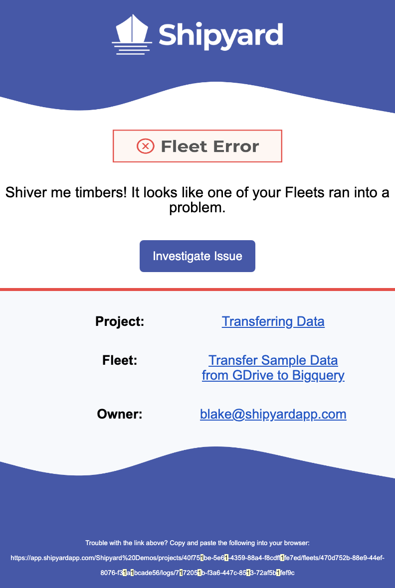

# Notifications

## Definition

Notifications provide an automated way to receive updates about the Vessels and Fleets you care most about. By default, notifications will be sent for the following events:

- If the Vessel or Fleet errors out
- If the Vessel or Fleet completes an On-Demand run

Notifications are only sent after the final [status](../other-functions/status.md) has been determined, not as soon as the issue occurs. For example, if your Vessel has [guardrails](guardrails.md) set to 3x, an error notification would not be sent until it had errored out all 3 times.

When initially creating a Vessel or Fleet, the owner's email will be added automatically. You can always add additional user emails to be notified about the Vessel, or remove your own email in place of another. Notifications are always a required field because _someone_ should always be aware if your scripts fail.

:::info
You can paste a comma-separated list of emails into the field and it will automatically separate them all.
:::

### Notification Content

Every email sent by Shipyard will contain links to the organizational structure of that element. This is designed to help you quickly dig into the platform. Structure included in the email:

**Fleets**
- Project
- Fleet
- Owner

**Vessel**
- Project
- Vessel
- Blueprint
- Owner

### Success Notification
In a success notification, a button will appear to **View Results**. This will direct you to the [Log](../logs/logs-overview.md) of the Vessel or Fleet that ran successfully.

Currently, you will only receive success notifications when a Vessel or Fleet was triggered [On-Demand](../triggers/on-demand-triggers.md).

### Error Notification

In an error notification, a button will appear to **Investigate Issue**. This will take you directly to the [Log](../logs/logs-overview.md) where the error occurred so that you can troubleshoot effectively.

If a Fleet errors out, you will only receive a notification for the Fleet, not every Vessel in the Fleet that errors out or doesn't run. This setup helps reduce notification overload in the event that something goes wrong.

## Screenshots

## Additional Notes

1. Notifications can only be sent via email. No other messaging platforms are supported at this time.
2. Emails provided do not have to have access to Shipyard to receive a notification.
3. Notification settings are the same for every user that is listed.
4. Notifications are only sent for 2 different event types. These event types cannot be changed at the moment.
5. Notifications are only applied at the Vessel and Fleet level. You cannot subscribe to notifications for a Blueprint \(and therefore all dependent Vessels\).
6. When a Fleet errors out, we will never designate which Vessel specifically errored out, as there could be multiple possibilities.
7. We recommend adding the Shipyard email address `notifications@shipyardapp.com` to your address book to ensure that alerts are never sent to spam.
