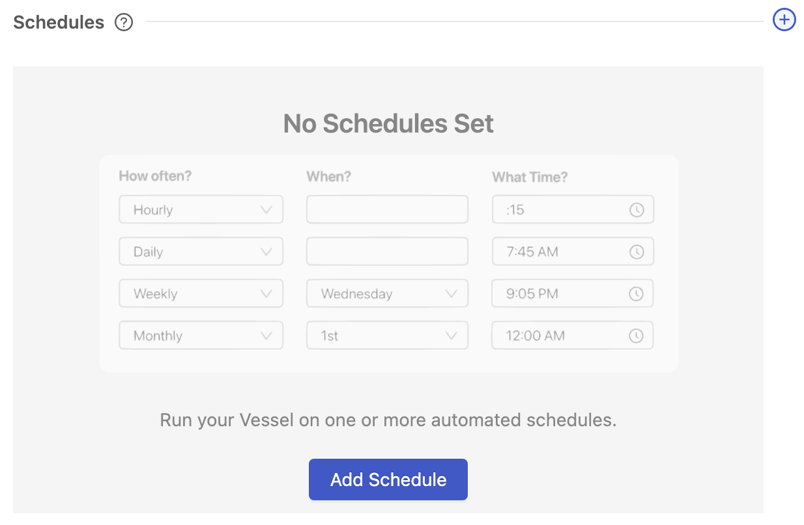
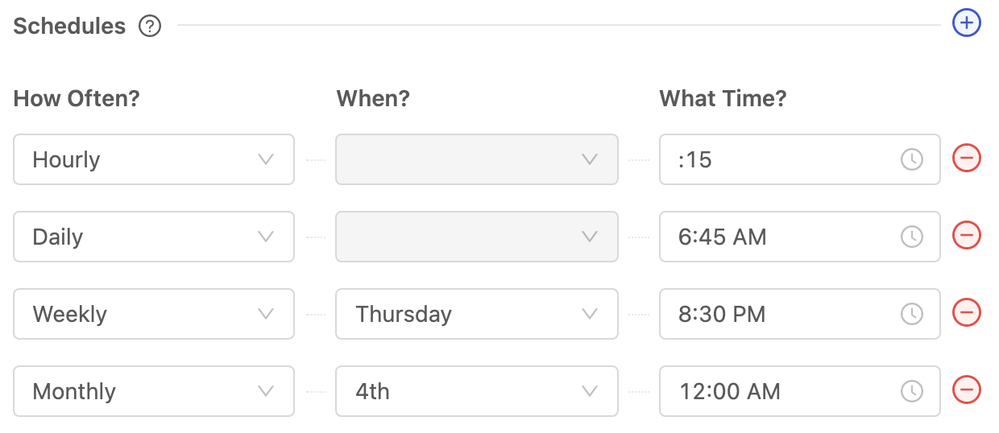

# Schedule Triggers

## Definition

On the Trigger tab for every Vessel and Fleet, you are provided with a section for creating and managing Schedule Triggers.

Schedule Triggers allow a Vessel or a Fleet to run autonomously in the background on our cloud infrastructure. To use an automated schedule, you must have one or more schedules listed. Fleets and Vessels will always use schedules that are visible.

### Types of Schedules

- **Hourly** - Select the distinct minute that you want a Vessel or Fleet to run every hour.
- **Daily** - Select the distinct time that you want a Vessel or Fleet to run every day.  
- **Weekly** - Select the day of the week and the time that you want a Vessel or Fleet to run every 7 days.  
- **Monthly** - Select the numeric day \(1-31\) and the time that you want a Vessel or Fleet to run every month.

### Timing of Schedules 

At 12:00am UTC, all runs for the next 24-hour cycle get added as empty logs with a [status ](../other-functions/status.md)of **Scheduled**.

If a schedule is added, removed, or changed after 12:00am UTC, the Vessel's scheduled runs will be updated to reflect the new schedule up until 11:59pm UTC of the current day.

All schedules will be created for the [Timezone](../other-functions/timestamps-and-timezones.md) set in the [Project](../projects.md) settings.

:::tip Pro Tip
Selecting a schedule of `Monthly` on the 31st will only result in a run being scheduled when the month has 31 days. If you want a schedule to run at the end of every month, we suggest instead scheduling it for the 1st.
:::

## Screenshots

## Additional Notes

1. A schedule's maximum frequency is every 5 minutes. If you need to run something more frequently, please reach out to [support](mailto:support@shipyardapp.com).
2. If a schedule is duplicated, the Vessel or Fleet will be run multiple times concurrently at the scheduled time.
3. There is currently no way to create a schedule that is tied to an irregular mix of dates and times. Some examples of schedules we don't natively support, but are still possible to create within Shipyard:
   1. A schedule that only runs on specific dates, like holidays.
   2. A schedule that runs every hour except on specific days.
   3. A schedule that can be described as "every other" or "every nth"
4. Vessels or Fleets may not run at exactly their scheduled time, as there is still time associated with entering a job queue, spinning up servers, and installing any [external package dependencies](../requirements/external-package-dependencies.md).

## Learn More

- [How to Add a Schedule Trigger](../../how-tos/triggers/add-schedule-trigger.md)
