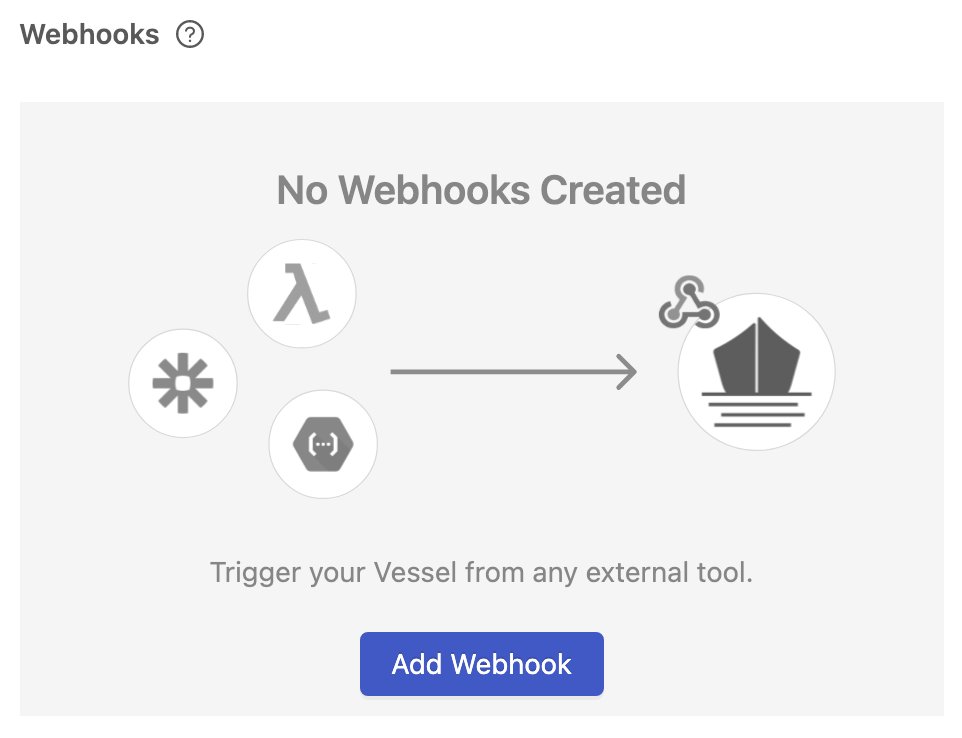

import Tabs from '@theme/Tabs';
import TabItem from '@theme/TabItem';

# Webhook Triggers

## Definition

On the Trigger tab for every Vessel and Fleet, you are provided with a section for creating and managing Webhook Triggers.

Webhook Triggers enable you to programmatically execute a Vessel or Fleet in Shipyard by running a POST request from any service. When you run the POST request, your Vessel or Fleet will be scheduled to run immediately.

When a webhook has been created, you will be given 3 options:

- Copy the entire webhook to your clipboard
- Replace the current webhook URL with a new webhook URL
- Remove the webhook URL from existence

## Webhook Status Codes

No matter which language or service you use to run the POST request, you will see the following status codes returned.

### 201 - Created Successfully

When your POST request returns a status code of 201, your entity has been successfully scheduled. Depending on which entity was run, you'll see a slightly different JSON response that includes multiple relevant Shipyard IDs.

<Tabs
groupId="element"
defaultValue="vessel"
values={[
{label: 'Vessel', value: 'vessel'},
{label: 'Fleet', value: 'fleet'},
]}>
<TabItem value="vessel">

```javascript
{
   "data" : {
      "org_id" : "2d52c575-989e-4642-bc63-c63408ee3fd8",
      "voyaged_id" : "88fab44e-2fa4-4e98-b91c-d5116bebf40c",
      "project_id" : "2caa1d4e-3054-40c1-82f1-50d7fa83fac2",
      "vessel_id" : "bbc31c05-557a-448b-bdd1-6f595213ddcd"
   },
   "request" : {
      "id" : "7ea6d061-e1d2-4b7d-9016-97af39a0f815"
   }
}
```

</TabItem>
<TabItem value='fleet'>

```javascript
{
   "request" : {
      "id" : "955939cc-2b90-4b8e-bf23-7375cd87822b"
   },
   "data" : {
      "fleet_id" : "cc3737df-06ee-431a-8f87-1e79f1eed6d6",
      "project_id" : "d1680f76-3b3c-420e-bbf3-9d62c6a2b450",
      "org_id" : "2d52c575-989e-4642-bc63-c63408ee3fd8",
      "fleet_run_id" : "ad4d4655-91fd-4499-9a1a-06d6e8a433d4"
   }
}
```

</TabItem>
</Tabs>

With this status code, you'll receive back IDs for the element you ran, alongside a unique request ID.

### 400 - Bad Requests

When your POST request returns a status code of 400, your request has failed. This is usually due to a webhook URL that is malformed or no longer exists. You'll see the following JSON response returned alongside this status code.

```javascript
{
   "request" : {
      "id" : "1af80dfc-e1b7-459f-9921-e5cb9e08b684"
   },
   "data" : null
}
```

## Screenshots




## Additional Notes

1. Webhooks only allow you to immediately run a Vessel or a Fleet in a programmatic manner. They do not currently support the passing of variables.
2. Each Vessel or Fleet can only have one webhook associated to it.
3. Vessels or Fleets may not run instantaneously, as there is still time associated with entering a job queue, spinning up servers, and installing any [external package dependencies](../requirements/external-package-dependencies.md).

## Learn More
- [How to Execute a Webhook Trigger](../../how-tos/triggers/execute-webhook-trigger.md)