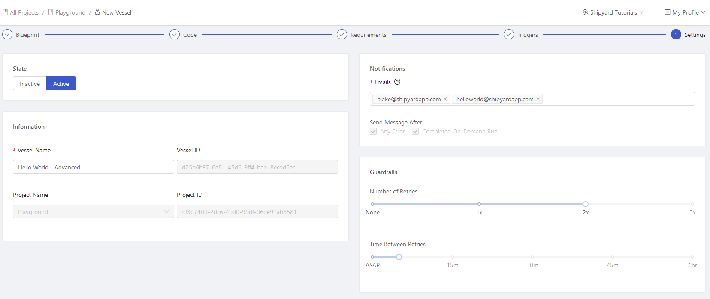
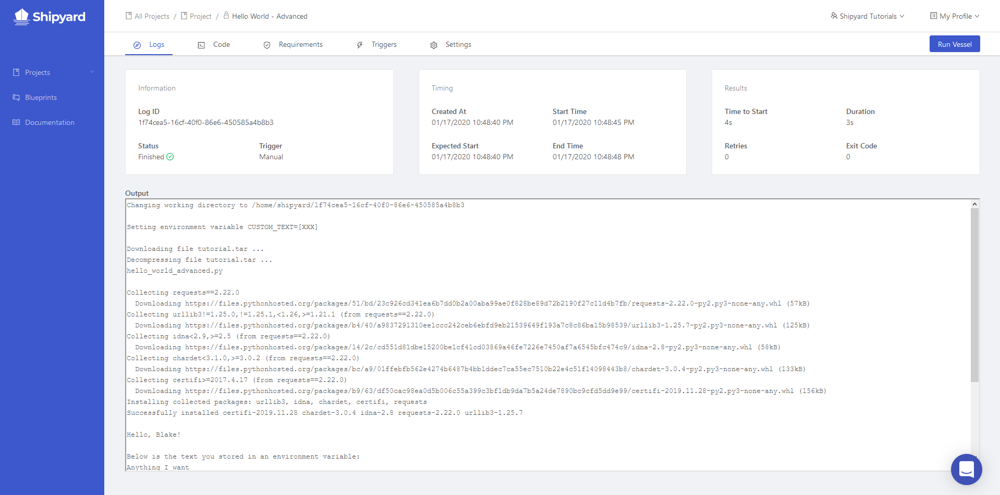

import Tabs from '@theme/Tabs';
import TabItem from '@theme/TabItem';

# Building an Advanced "Hello World" Vessel

## Overview

In this tutorial, you'll walk through the steps required to set up a more advanced Vessel that prints `Hello, World`. This contains many of the same steps as our original Hello World tutorial, with added steps to teach more features of the platform. This tutorial is only in Python \(for now\).

By the end of the tutorial, you'll be able to:

- Set up a Vessel using a Code Blueprint
- Upload a script to Shipyard.
- Pass arguments to your solution.
- Pass environment variables to your solution.
- Install packages for your solution.
- Reference platform variables.
- Create a schedule.
- Check to verify that a Vessel ran successfully.

## Setup

:::caution
For the sake of the this tutorial, we suggest starting off by building a Vessel inside of a Project called "Playground". You can follow [**this tutorial** ](building-playground-project.md)to set that up.
:::

Download the following file to your computer, without changing the file name. It's a .zip containing a single python file that we'll use throughout this tutorial.



Feel free to peruse this script beforehand so you understand everything that it's doing. The script is accomplishing four main things:

1. Prints `Hello` and `{your_name}` by referencing the command argument of `--name`.
2. Prints custom text that is stored as an environment variable called `CUSTOM_TEXT`.
3. Connects to an [external API](https://alexwohlbruck.github.io/cat-facts/), using the requests library, to find and print a random Cat Fact.
4. Prints information about the current run, including a timestamp and a link to the current log by using [Platform Environment Variables](../reference/vessels/environment-variables/platform-environment-variables.md).

## Steps

1. Using the sidebar, click on "Projects" to expand the list of projects.
2. Click on the "Playground" project. You'll be directed to the Vessels tab for the Playground project.
3. Click on the "Build Vessel" button in the top-right corner of the screen.

   

4. A modal will pop up asking you what type of blueprint you would like to use to build your Vessel. On the left side of the modal, you'll see an option for a **Code Blueprint**. Click "Select" for this option.

:::tip Success
You've successfully started the setup flow for building a Vessel using a Code Blueprint!
:::

We'll now walk through the process of filling out the next 5 steps to create our Advanced "Hello World" Vessel. Select the tab of either **Python** or **Bash** to get language specific instructions.

### Step 1 - Select a Blueprint

<Tabs
groupId="languages"
defaultValue="python"
values={[
{label: 'Python', value: 'python'},
]}>
<TabItem value="python">
Click on the **Python** Blueprint. You'll be immediately redirected to the next step.
</TabItem>
</Tabs>

### Step 2 - Provide your Code

On the left side of the screen, make sure the **Upload** button is selected. This will change the fields below to look like the following:

<Tabs
groupId="languages"
defaultValue="python"
values={[
{label: 'Python', value: 'python'},
]}>
<TabItem value="python">

1. Click the upload section of page and select the `tutorial.tar` file from you computer.
2. On the right-hand side of the screen, there is a field entitled **File to Run**. Because the .zip contains a single python file named `hello_world_advanced.py`, you'll need use that name.
3. Click the "plus" icon next to arguments to create a new [command argument](../reference/vessels/code/command.md#arguments).
4. In the **flag** field on the left-hand side, type `--name`.
5. In the **value** field on the right-hand side of the new argument, type your name.

</TabItem>
</Tabs>

Once you're done, click the **Next Step** button at the bottom of the screen.

### **Step 3 - Requirements**

#### Environment Variables

1. Click the "plus" icon next to Environment Variables to add a new variable.
2. In the **KEY** field on the left-hand side, type `CUSTOM_TEXT`.
3. In the **Value** field, type anything you want. This text will be printed at the end.

:::caution
**Note:** The value field will always show `•••••••` as you type. This is because Environment Variables are commonly used for passwords and secrets. You can always reveal what you've written by clicking the eye icon.
:::

#### Packages

<Tabs
groupId="languages"
defaultValue="python"
values={[
{label: 'Python', value: 'python'},
]}>
<TabItem value="python">

1. Click the "plus" icon next to Packages to add a new package.
2. In the **Package Name** field on the left-hand side, type `requests`.
3. In the **Version** field on the right-hand side, type `==2.22.0`

:::caution
The Version must match the formatting for [requirements files](https://www.python.org/dev/peps/pep-0440/#version-specifiers).
:::
</TabItem>
</Tabs>

Once you're done, go ahead and click the **Next Step** button at the bottom of the screen.

### Step 4 - Triggers

1. Make sure the **Schedule** button is selected.
2. Click the "plus" icon to make a new schedule.
3. Under **How Often** select **Daily**.
4. Select a time that's 15 minutes in the future from now.

:::caution
**Note:** The Vessel will be scheduled according to its project's timezone. If you didn't set the Playground project to your current time zone, it will not be scheduled to run 10 minutes in the future.
:::

Click the **Next Step** button at the bottom of the screen.

### **Step 5 - Settings**

1. Under the State section, select **Active**.
2. Under the Information section, give your Vessel the name of `Hello World - Advanced`.
3. Under the notifications section, make sure that your email is listed. It should be added by default.
4. Add an additional notification email of "[helloworld@shipyardapp.com](mailto:helloworld@shipyardapp.com)". You'll notice that you can add any user or alias to the notification list, whether or not they have access to your organization.
5. Under the Guardrails section, set the **Number of Retries** to 2x and the **Time Between Retries** to 5m.
6. Click the **Save & Finish** button at the bottom of the screen.

:::info
**Tip:** We changed the default Guardrails because of the potential for the Cat Facts API to have connection issues.
:::

### Step 6 - Running the Vessel

Go ahead and click **Run Your Vessel**. This will schedule your Vessel to run immediately and redirect you to the **Individual** **Log** page.

:::caution
**Note:** You should see two logs. One that has been triggered On Demand from you clicking the button and another that has a Schedule trigger for the time you set in [Step 4.](building-a-more-advanced-hello-world-vessel.md#step-4-triggers)
:::

### Step 7 - Checking the Log

You should see the following page that shows you all of the details about the specific Log.

:::caution
**Note:** If the Vessel has a Status of **Scheduled or Running** you may see sections of this page that are incomplete.

Wait a few seconds for your Vessel to run. The page will automatically refresh.
:::

In the output, you'll see a total of 6 things.

1. Shipyard creates a working directory under `/home/shipyard/{voyage_id}`
2. Shipyard downloads the file you created under the [Code ](building-a-hello-world-vessel.md#step-2-provide-your-code)section, decompresses it, and begins to run `hello_world_advanced.py`
3. Shipyard installs the package requested, `Requests`
4. Shipyard prints the text `Hello, {your name}!`
5. Shipyard prints out the custom text you wrote.
6. Shipyard prints out a cat fact.
7. Shipyard prints out your Vessel Name, the time it ran, and a link to that specific run.

### Step 8 - Viewing all Logs

On the current page, click the **Logs** tab at the top. This will redirect you back to all of the Logs for the Vessel you just made.

You should see two longs. One that has been triggered On Demand from you clicking the button and another that has a Schedule trigger for the time you set in [Step 4.](building-a-more-advanced-hello-world-vessel.md#step-4-triggers)

:::tip Success
You've successfully created and verified an Advanced Vessel!
:::
